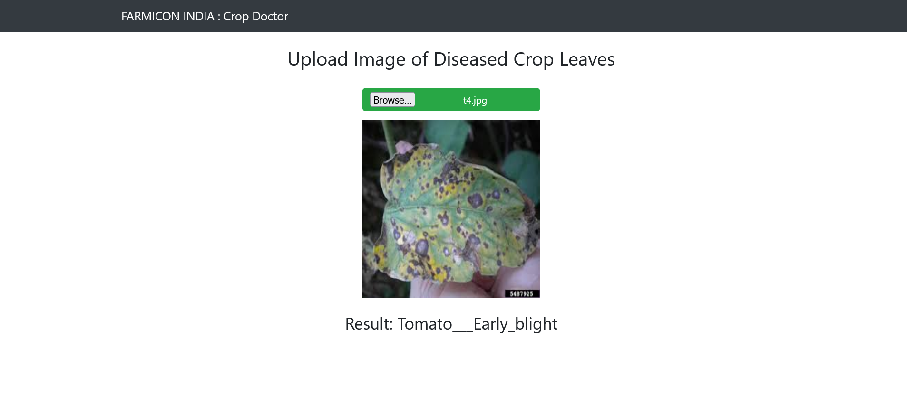

# CROP DOCTOR

This project demonstrates the use of Flask to create a web application that interfaces with a Keras model to identify diseases in crop leaves through image classification.



## Prerequisites
Install the dependencies 
``` bash
pip install -r requirements.txt
```

> **Note:** This project requires Python 3.8 or higher 

## Usage
1. To run locally either run from the IDE or use the following command:
```bash
python app.py
```

2. Open your web browser and visit `http://localhost:3000`
3. Select an image and click on the `Predict Image` button

## Licence 
This project is licensed under the MIT Licence.
"# crop_doctor" 
